# nettix-smpp

SMPP 3.4 protocol implementation built on [nettix](https://github.com/osanha/nettix) for SMS messaging.

## Overview

nettix-smpp provides a complete SMPP (Short Message Peer-to-Peer) protocol implementation for building SMS applications. It includes both SME (Short Message Entity) client and SMSC (Short Message Service Center) server components with full PDU support.

## Features

- **Full SMPP 3.4 Support**: Complete PDU implementation including all bind modes
- **SME Client (SmppClient)**: Connect to SMSC for sending/receiving SMS
- **SMSC Server (SmppServer)**: Build your own SMSC or SMSC simulator
- **Bind Modes**: Transmitter, Receiver, and Transceiver modes
- **Delivery Receipts**: MT-SMS delivery status handling with `SmppClientListener` callbacks
- **MO/MT Support**: Both Mobile Originated and Mobile Terminated messaging
- **Async Future API**: `CallableChannelFuture<String>` for non-blocking MT SMS transmission
- **Auto-Reconnection**: Persistent connection with automatic reconnection via nettix
- **Enquire Link**: Built-in connection keep-alive mechanism

## Requirements

- Java 6+
- nettix 3.11+

## Installation

Available on
[](https://jitpack.io/#osanha/nettix-smpp)

> **Note:**
>  When distributed via JitPack, the groupId is resolved as com.github.osanha based on the GitHub repository owner.
>
> Future releases will be available on Maven Central with coordinates `io.nettix:nettix-smpp`.

### Maven

Add the dependency:

```xml
<dependency>
    <groupId>com.github.osanha</groupId>
    <artifactId>nettix-smpp</artifactId>
    <version>1.0.0</version>
</dependency>
```

Add the JitPack repository to your `pom.xml`:

```xml
<repositories>
    <!--Prioritize Central repository for faster dependency resolution-->
    <repository>
        <id>central</id>
        <url>https://repo.maven.apache.org/maven2</url>
    </repository>
    <repository>
        <id>jitpack.io</id>
        <url>https://jitpack.io</url>
    </repository>
</repositories>
```

### Gradle

```kotlin
repositories {
    mavenCentral()
    maven { url = uri("https://jitpack.io") }
}

dependencies {
    implementation("com.github.osanha:nettix-smpp:1.0.0")
}
```

## Quick Start

### SMPP Client (SME)

#### 1. Basic Configuration and Listener Implementation

```java
import io.nettix.smpp.client.SmppClient;
import io.nettix.smpp.client.SmppClientListener;
import io.nettix.smpp.conf.*;
import io.nettix.channel.CallableChannelFuture;
import org.jboss.netty.buffer.ChannelBuffer;
import org.jboss.netty.buffer.ChannelBuffers;
import org.jboss.netty.util.CharsetUtil;

// SmppClientListener implementation - handles delivery results and MO SMS reception
SmppClientListener listener = new SmppClientListener() {

    /**
     * MT SMS delivery success to handset (Delivery Receipt: DELIVRD)
     * - Called when deliver_sm (esm_class=0x04) is received from SMSC
     * - Indicates the handset has actually received the message
     */
    @Override
    public void mtSuccess(String smscId, String msgId) {
        System.out.println("[" + smscId + "] Delivery success: msgId=" + msgId);
        // Post-processing such as DB status update
    }

    /**
     * MT SMS delivery failure to handset (Delivery Receipt: UNDELIVR, EXPIRED, etc.)
     * - Handset powered off, invalid number, validity period expired, etc.
     */
    @Override
    public void mtFailure(String smscId, String msgId, String state) {
        System.out.println("[" + smscId + "] Delivery failed: msgId=" + msgId + ", state=" + state);
        // state: "UNDELIVR"(undeliverable), "EXPIRED"(expired), "DELETED"(deleted), "REJECTD"(rejected), etc.
    }

    /**
     * MO SMS received (Mobile Originated - message sent by user)
     * - Called when deliver_sm (esm_class=0x00) is received from SMSC
     */
    @Override
    public void moReceived(String smscId, String sender, ChannelBuffer msg) {
        String content = msg.toString(CharsetUtil.UTF_8);
        System.out.println("[" + smscId + "] MO received: from=" + sender + ", msg=" + content);
        // Message processing logic
    }
};

// Server configuration (SMSC connection info)
// - If moPort equals mtPort, uses Transceiver mode (single connection)
// - Otherwise, uses Transmitter/Receiver mode (dual connection)
SmppServerConf serverConf = new SmppServerConf("smsc.example.com", 2775, 2775);
serverConf.setEnquireLink(30);      // Keep-alive interval (seconds)
serverConf.setRespTimeout(10);      // Response timeout (seconds)
serverConf.setReconnDelay(5);       // Reconnection delay (seconds)

// Bind configuration (authentication)
SmppBindConf bindConf = new SmppBindConf("mySystemId", "myPassword");
bindConf.setSystemType("SMS");
bindConf.setInterfaceVersion(0x34); // SMPP 3.4

// Submit configuration (MT SMS defaults)
SmppSubmitConf submitConf = new SmppSubmitConf("15881234"); // Source address
submitConf.setRegisteredDelivery(0x01);  // Request Delivery Receipt
submitConf.setDataCoding(0x08);          // UCS2 encoding
submitConf.setValidityPeriod(3600 * 24); // Validity period: 24 hours

// Combine client configuration
SmppClientConf clientConf = new SmppClientConf(serverConf, bindConf, submitConf);

// Create and start SmppClient
SmppClient client = new SmppClient("SMSC-1", clientConf, listener);
client.start();
```

#### 2. MT SMS Transmission - Handling SMSC Response via Future

```java
// Create message (UCS2 encoding)
String text = "Hello. This is a test message.";
ChannelBuffer message = ChannelBuffers.copiedBuffer(text, CharsetUtil.UTF_16BE);

// Send MT SMS - asynchronous
CallableChannelFuture<String> future = client.sendMessage("01012345678", message);

// Handle SMSC transmission result via Future
// - Success: submit_sm_resp (ESME_ROK) received - SMSC accepted the message
// - Failure: submit_sm_resp (error code) or timeout/connection lost
future.addListener(new ChannelFutureListener() {
    @Override
    public void operationComplete(ChannelFuture f) {
        if (f.isSuccess()) {
            // SMSC transmission success - returns message_id
            String msgId = ((CallableChannelFuture<String>) f).get();
            System.out.println("SMSC transmission success: msgId=" + msgId);
            // Use this msgId to match subsequent Delivery Receipt
            // Final delivery result to handset is received via SmppClientListener.mtSuccess/mtFailure
        } else {
            // SMSC transmission failure
            Throwable cause = f.getCause();
            if (cause instanceof SmppException) {
                // SMPP error (invalid number, throttling, etc.)
                System.err.println("SMPP error: " + cause.getMessage());
            } else if (cause instanceof ReadTimeoutException) {
                // Response timeout
                System.err.println("Response timeout");
            } else if (cause instanceof ClosedChannelException) {
                // Connection lost
                System.err.println("Connection lost");
            }
        }
    }
});

// Synchronous wait
try {
    future.await(30, TimeUnit.SECONDS);
    if (future.isSuccess()) {
        String msgId = future.get();
        System.out.println("Send complete: " + msgId);
    }
} catch (InterruptedException e) {
    Thread.currentThread().interrupt();
}
```

#### 3. Complete SMS Transmission Flow

```
┌──────────────────────────────────────────────────────────────────────────────┐
│                       MT SMS Complete Transmission Flow                       │
├──────────────────────────────────────────────────────────────────────────────┤
│                                                                              │
│  [Application]              [SmppClient]              [SMSC]      [Handset] │
│       │                          │                      │            │       │
│       │ sendMessage()            │                      │            │       │
│       │─────────────────────────>│                      │            │       │
│       │                          │                      │            │       │
│       │ CallableChannelFuture    │    submit_sm         │            │       │
│       │<─────────────────────────│─────────────────────>│            │       │
│       │                          │                      │            │       │
│       │                          │    submit_sm_resp    │            │       │
│       │                          │<─────────────────────│            │       │
│       │                          │    (message_id)      │            │       │
│       │                          │                      │            │       │
│       │ Future.setSuccess(msgId) │                      │            │       │
│       │<─────────────────────────│                      │            │       │
│       │                          │                      │            │       │
│       │ ┌────────────────────────────────────────────────────────────┐       │
│       │ │ Phase 1 Complete: SMSC transmission success (Future done)  │       │
│       │ │    - msgId can be used to match subsequent Delivery Receipt│       │
│       │ └────────────────────────────────────────────────────────────┘       │
│       │                          │                      │            │       │
│       │                          │                      │  SMS Send  │       │
│       │                          │                      │───────────>│       │
│       │                          │                      │            │       │
│       │                          │                      │   Result   │       │
│       │                          │                      │<───────────│       │
│       │                          │                      │            │       │
│       │                          │    deliver_sm        │            │       │
│       │                          │<─────────────────────│            │       │
│       │                          │   (Delivery Receipt) │            │       │
│       │                          │                      │            │       │
│       │ mtSuccess() or           │    deliver_sm_resp   │            │       │
│       │ mtFailure() callback     │─────────────────────>│            │       │
│       │<─────────────────────────│                      │            │       │
│       │                          │                      │            │       │
│       │ ┌────────────────────────────────────────────────────────────┐       │
│       │ │ Phase 2 Complete: Handset delivery result (Listener callback)│     │
│       │ │    - DELIVRD: Handset received successfully                │       │
│       │ │    - UNDELIVR/EXPIRED/etc: Handset delivery failed         │       │
│       │ └────────────────────────────────────────────────────────────┘       │
│                                                                              │
└──────────────────────────────────────────────────────────────────────────────┘
```

#### 4. Connection Shutdown

```java
// Graceful shutdown (unbind then disconnect)
client.stop();
```

### SMPP Server (SMSC Simulator)

```java
SmppServer server = new SmppServer("TestSMSC", 2775);

// Set credentials for SME authentication
Map<String, String> credentials = new HashMap<>();
credentials.put("myapp", "secret");
server.setCredential(credentials);

// Handle incoming MT-SMS from connected SMEs
server.setListener(new SmppServerListener() {
    @Override
    public void messageReceived(String messageId, String sender,
                                 String receiver, ChannelBuffer message) {
        System.out.println("MT-SMS received:");
        System.out.println("  From: " + sender);
        System.out.println("  To: " + receiver);
        System.out.println("  Message: " + message.toString(CharsetUtil.UTF_8));
    }
});

server.setUp();

// Send MO-SMS to connected SMEs
ChannelBuffer moMessage = ChannelBuffers.copiedBuffer("Reply", CharsetUtil.UTF_8);
server.writeRequested("01098765432", "01012345678", moMessage);
```

## Supported PDUs

### Request PDUs

| PDU | Description |
|-----|-------------|
| `BindTransmitter` | Bind as transmitter (MT only) |
| `BindReceiver` | Bind as receiver (MO only) |
| `BindTransceiver` | Bind as transceiver (MT + MO) |
| `Unbind` | Terminate SMPP session |
| `SubmitSm` | Submit MT-SMS |
| `SubmitMulti` | Submit to multiple destinations |
| `DeliverSm` | Deliver MO-SMS (SMSC → SME) |
| `QuerySm` | Query message status |
| `CancelSm` | Cancel pending message |
| `ReplaceSm` | Replace pending message |
| `EnquireLink` | Connection keep-alive |
| `DataSm` | Extended messaging |

### Response PDUs

| PDU | Description |
|-----|-------------|
| `BindTransmitterResp` | Bind transmitter response |
| `BindReceiverResp` | Bind receiver response |
| `BindTransceiverResp` | Bind transceiver response |
| `UnbindResp` | Unbind response |
| `SubmitSmResp` | Submit response with message_id |
| `DeliverSmResp` | Deliver response |
| `EnquireLinkResp` | Enquire link response |
| `GenericNack` | Generic negative acknowledgement |

## SMPP Flow

### MT-SMS (Mobile Terminated)

```
    SME (Client)                    SMSC (Server)
         │                               │
         │──── bind_transceiver ────────>│
         │<─── bind_transceiver_resp ────│
         │                               │
         │──── submit_sm ───────────────>│
         │<─── submit_sm_resp ───────────│ (message_id)
         │                               │
         │<─── deliver_sm ───────────────│ (delivery receipt)
         │──── deliver_sm_resp ─────────>│
         │                               │
```

### MO-SMS (Mobile Originated)

```
    SME (Client)                    SMSC (Server)
         │                               │
         │<─── deliver_sm ───────────────│ (MO message)
         │──── deliver_sm_resp ─────────>│
         │                               │
```

### Keep-Alive

```
    SME (Client)                    SMSC (Server)
         │                               │
         │──── enquire_link ────────────>│
         │<─── enquire_link_resp ────────│
         │                               │
```

## Configuration Options

### SME Configuration

```java
SmppSmeConfig config = new SmppSmeConfig();

// Connection
config.setSmscAddress("smsc.example.com");
config.setSmscMtPort(2775);       // For transmitter/transceiver
config.setSmscMoPort(2776);       // For receiver (if separate)
config.setReconnDelay(30);        // Reconnection delay in seconds

// Bind parameters
config.setSystemId("myapp");
config.setPassword("secret");
config.setSystemType("SMS");
config.setInterfaceVersion(0x34); // SMPP 3.4
config.setAddrTon(0x01);          // International
config.setAddrNpi(0x01);          // ISDN

// Timing
config.setEnquireLinkDelay(60);   // Keep-alive interval
config.setResponseTimeout(10);    // Response timeout
```

### Server Configuration

```java
SmppServer server = new SmppServer("MySMSC", 2775);
server.setEnquireLinkDelay(60);
server.setResTimeout(10);
server.setCredential(credentialMap);
```

## Delivery Receipt Parsing

```java
// Custom delivery receipt parser
public class MyDeliveryReceipt implements DeliveryReceipt {
    @Override
    public Result parse(ChannelBuffer data) {
        String text = data.toString(CharsetUtil.US_ASCII);
        // Parse delivery receipt format
        // Format: "id:XXXX sub:001 dlvrd:001 submit date:... done date:... stat:DELIVRD"
        return new Result(messageId, state);
    }
}
```

## Error Handling

```java
try {
    CallableChannelFuture<String> future = sme.smsRequested(receiver, message);
    future.await(30, TimeUnit.SECONDS);

    if (future.isSuccess()) {
        String messageId = future.get();
    } else {
        Throwable cause = future.getCause();
        if (cause instanceof SmsException) {
            // SMPP error (e.g., ESME_RINVDSTADR)
        } else if (cause instanceof ReadTimeoutException) {
            // Response timeout
        } else if (cause instanceof ClosedChannelException) {
            // Connection lost
        }
    }
} catch (Exception e) {
    // Handle exception
}
```

## Class Diagram

Class diagram including classes that inherit from the nettix framework.

```mermaid
classDiagram
    direction TB

    %% nettix framework classes (external)
    class PersistentClientChannelManager {
        <<nettix>>
        +setUp()
        +tearDown()
        +connect(SocketAddress)
        +setReconnDelay(int)
        +setConnInterval(int)
        +setConnTimeout(int)
    }

    class HeartbeatHandler~T~ {
        <<nettix>>
        #HeartbeatHandler(name, delay, timeout, factory)
    }

    class HeartbeatFactory~T~ {
        <<nettix>>
        +createHeartbeat() T
    }

    class CallableChannelFuture~T~ {
        <<nettix>>
        +get() T
        +setSuccess(T)
        +setFailure(Throwable)
        +isSuccess() boolean
        +await(timeout, unit)
        +addListener(ChannelFutureListener)
    }

    class TimeoutableMap~K,V~ {
        <<nettix>>
        +put(K, V)
        +remove(K) V
        +setTimeoutHandler(TimeoutHandler)
    }

    class RoundRobinInteger {
        <<nettix>>
        +next() int
    }

    %% Netty classes (external)
    class OneToOneEncoder {
        <<netty>>
        #encode(ctx, channel, msg) Object
    }

    class OneToOneDecoder {
        <<netty>>
        #decode(ctx, channel, msg) Object
    }

    class SimpleChannelHandler {
        <<netty>>
        +messageReceived(ctx, e)
        +writeRequested(ctx, e)
    }

    class SimpleChannelUpstreamHandler {
        <<netty>>
        +channelConnected(ctx, e)
        +channelDisconnected(ctx, e)
        +messageReceived(ctx, e)
        +exceptionCaught(ctx, e)
    }

    %% nettix-smpp Client classes
    class SmppClient {
        -String _id
        -SmppClientListener _listener
        -SmppClientConf _conf
        -Channel _mtCh
        -Channel _moCh
        -DeliveryReceipt _deliveryReceipt
        +SmppClient(id, conf, listener)
        +SmppClient(id, conf, listener, receipt)
        +sendMessage(receiver, msg) CallableChannelFuture~String~
        +setListener(listener)
        +isActive() boolean
        +setUp()
        +tearDown()
    }

    class SmppClientHandler {
        <<inner class>>
        -bind(ch, pdu) ChannelFuture
        -handleDeliveryReceipt(sms)
        +channelConnected(ctx, e)
        +channelDisconnected(ctx, e)
        +messageReceived(ctx, e)
        +exceptionCaught(ctx, e)
    }

    class SmppClientListener {
        <<interface>>
        +mtSuccess(smscId, msgId)
        +mtFailure(smscId, msgId, state)
        +moReceived(smscId, sender, msg)
    }

    %% Handler classes
    class SmppEnquireLinkHandler {
        +SmppEnquireLinkHandler(name, delay, timeout, sequencer)
    }

    class SmppEncoder {
        #encode(ctx, channel, msg) Object
    }

    class SmppDecoder {
        #decode(ctx, channel, msg) Object
    }

    class SmppLogger {
        -Logger _logger
        +SmppLogger(id)
        +writeRequested(ctx, e)
        +messageReceived(ctx, e)
    }

    %% Configuration classes
    class SmppClientConf {
        -SmppServerConf _serverConf
        -SmppBindConf _bindConf
        -SmppSubmitConf _submitConf
        +SmppClientConf(serverConf, bindConf, submitConf)
        +serverConf() SmppServerConf
        +bindConf() SmppBindConf
        +submitConf() SmppSubmitConf
    }

    class SmppServerConf {
        -String _address
        -int _moPort
        -int _mtPort
        -int _enquireLink
        -int _reconnDelay
        -int _connInterval
        -int _connTimeout
        -int _respTimeout
        +SmppServerConf(address, moPort, mtPort)
    }

    class SmppBindConf {
        -String _systemId
        -String _password
        -String _systemType
        -Integer _interfaceVersion
        -Integer _addrTon
        -Integer _addrNpi
        -String _addressRange
        +SmppBindConf(systemId, password)
    }

    class SmppSubmitConf {
        -String _sourceAddr
        -int _registeredDelivery
        -int _dataCoding
        -String _validityPeriod
        +SmppSubmitConf(sourceAddr)
        +setValidityPeriod(sec)
    }

    %% Delivery Receipt classes
    class DeliveryReceipt {
        <<interface>>
        +parse(msg) Result
    }

    class DefaultDeliveryReceipt {
        +parse(msg) Result
    }

    class Result {
        -String _msgId
        -String _state
        +Result(msgId, state)
        +msgId() String
        +state() String
    }

    %% Inheritance relationships (nettix)
    PersistentClientChannelManager <|-- SmppClient : extends
    HeartbeatHandler <|-- SmppEnquireLinkHandler : extends
    HeartbeatFactory <.. SmppEnquireLinkHandler : uses

    %% Inheritance relationships (netty)
    OneToOneEncoder <|-- SmppEncoder : extends
    OneToOneDecoder <|-- SmppDecoder : extends
    SimpleChannelHandler <|-- SmppLogger : extends
    SimpleChannelUpstreamHandler <|-- SmppClientHandler : extends

    %% Implementation relationships
    DeliveryReceipt <|.. DefaultDeliveryReceipt : implements
    SmppClientListener <.. SmppClient : uses

    %% Composition relationships
    SmppClient *-- SmppClientHandler : contains
    SmppClient o-- SmppClientConf : has
    SmppClient o-- DeliveryReceipt : has
    SmppClient o-- TimeoutableMap : has
    SmppClient o-- RoundRobinInteger : has

    SmppClientConf *-- SmppServerConf : contains
    SmppClientConf *-- SmppBindConf : contains
    SmppClientConf *-- SmppSubmitConf : contains

    DefaultDeliveryReceipt ..> Result : creates
```



### Key Inheritance Relationships

| nettix-smpp Class | Relationship | nettix/netty Class | Description |
|-------------------|--------------|-------------------|-------------|
| `SmppClient` | extends | `PersistentClientChannelManager` (nettix) | Client with auto-reconnection support |
| `SmppEnquireLinkHandler` | extends | `HeartbeatHandler<EnquireLink>` (nettix) | Keep-alive handling |
| `SmppEncoder` | extends | `OneToOneEncoder` (netty) | PDU to bytes encoding |
| `SmppDecoder` | extends | `OneToOneDecoder` (netty) | Bytes to PDU decoding |
| `SmppLogger` | extends | `SimpleChannelHandler` (netty) | PDU logging |
| `SmppClientHandler` | extends | `SimpleChannelUpstreamHandler` (netty) | Message reception handling |

## Architecture

```
┌─────────────────────────────────────────────────────────┐
│                      SmppClient                          │
│  ┌───────────────────────────────────────────────────┐  │
│  │  sendMessage() → SubmitSm → SMSC                  │  │
│  │  DeliverSm (MO/Receipt) → handleMO/handleReceipt  │  │
│  │  SmppClientListener callback handling             │  │
│  └───────────────────────────────────────────────────┘  │
│                          │                               │
│  ┌───────────────────────▼───────────────────────────┐  │
│  │  SmppEncoder │ SmppDecoder │ SmppEnquireLinkHandler│  │
│  └───────────────────────────────────────────────────┘  │
│                          │                               │
│  ┌───────────────────────▼───────────────────────────┐  │
│  │        PersistentClientChannelManager (nettix)    │  │
│  │          (Auto-reconnection support)              │  │
│  └───────────────────────────────────────────────────┘  │
└─────────────────────────────────────────────────────────┘
                           │
                      TCP Connection
                           │
┌─────────────────────────────────────────────────────────┐
│                     SmppServer                           │
│  ┌───────────────────────────────────────────────────┐  │
│  │  Bind handling │ SubmitSm → Listener              │  │
│  │  writeRequested() → DeliverSm (MO)                │  │
│  └───────────────────────────────────────────────────┘  │
│                          │                               │
│  ┌───────────────────────▼───────────────────────────┐  │
│  │  SmppEncoder │ SmppDecoder │ SmppEnquireLinkHandler│  │
│  └───────────────────────────────────────────────────┘  │
│                          │                               │
│  ┌───────────────────────▼───────────────────────────┐  │
│  │             ServerChannelManager                  │  │
│  └───────────────────────────────────────────────────┘  │
└─────────────────────────────────────────────────────────┘
```

## Use Cases

- SMS Gateway integration
- A2P (Application-to-Person) messaging
- SMS notification services
- Two-factor authentication (2FA) via SMS
- SMSC testing and simulation
- SMS routing and aggregation

## Related Projects

- [nettix](https://github.com/osanha/nettix) - Core networking framework

## References

- [SMPP Protocol Specification v3.4](https://smpp.org/SMPP_v3_4_Issue1_2.pdf)

## License

MIT License

## Author

sanha